# mv_to_android


## 概要
* RPGツクールMVで作成されたプロジェクトをAndroidアプリ化するためのAndroid Studio プロジェクトです。
* プラグインは不要、RPGツクールMVでデプロイメントしたファイルを所定の場所に配置するだけです。
* Android側でWebViewを表示し、RPGツクールMVで出力されたhtml/javascriptを読み込みます。
* ローカル(`file://`)で実行される `XMLHttpRequest`等のCORSを回避するために、[WebViewAssetLoader](https://developer.android.com/reference/androidx/webkit/WebViewAssetLoader)を使用しています。


## 必要なもの

* [RPGツクールMV](http://tkool.jp/mv/)
* [Android Studio](https://developer.android.com/studio/index.htm)
* Android5.1以上


## 使い方

1. githubよりCloneもしくは[zipをダウンロード](https://github.com/waffs702/mv_to_android/archive/master.zip)します。

2. ダウンロードした場合は、zipを解凍します。

3. mv_to_androidの`app`フォルダ配下に、`htmlSource`フォルダを作成します。

4. RPGツクールMVプロジェクトをAndroid/iOS用にデプロイメントします。
    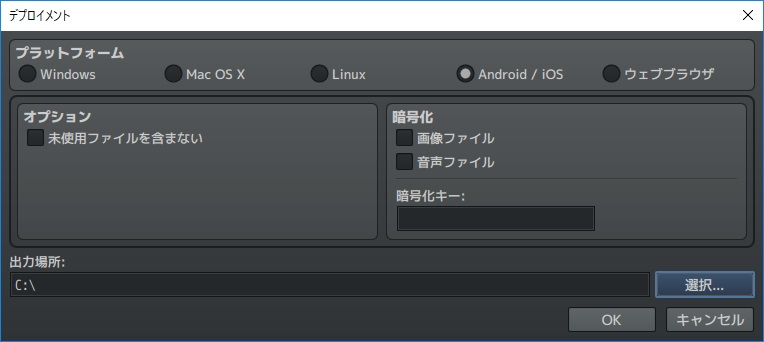

5. デプロイメントされたwwwフォルダ配下のファイルを、mv_to_androidの`app/htmlSource`フォルダ配下に配置します。
    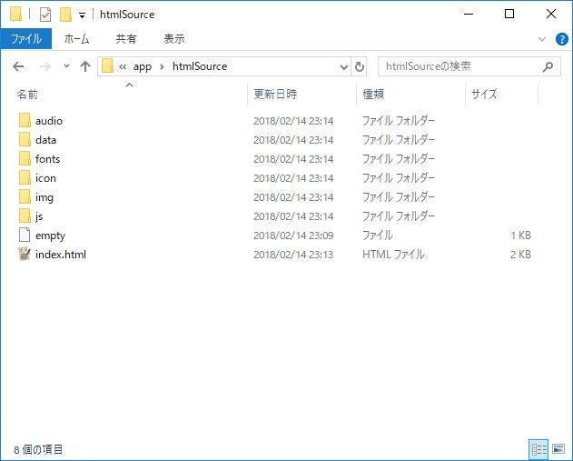

6. Android Studioでmv_to_androidを開きます。

   - `Open an existing Android Studio project`をクリック
     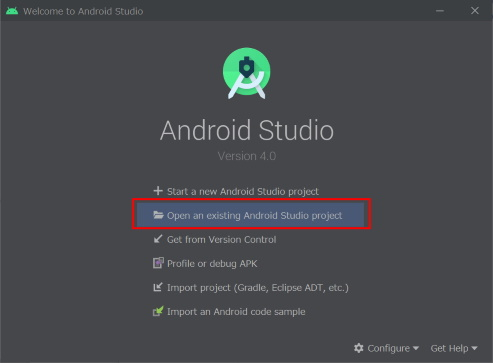

   - mv_to_androidのフォルダを選択し、`OK`をクリック
     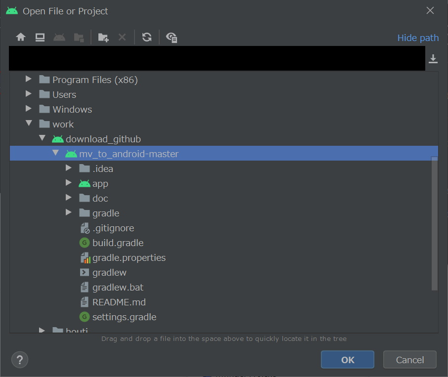

   - プロジェクトが開きます。

   

7. PCにAndroid端末を接続し、`Debug app`アイコンをクリックすると、Androidにアプリがインストールされデバッグモードで起動します。
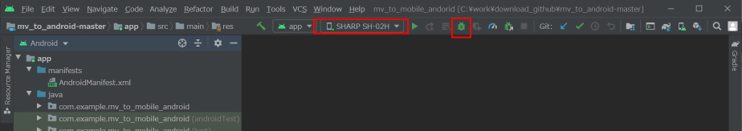


## 動作確認

- Android Studio 4.0
- RPGツクールMV 1.6.2
- Android 5.1
- Andorid 9


## プロジェクト名の変更方法
1. プロジェクトの表示を`Android`に変更します。
    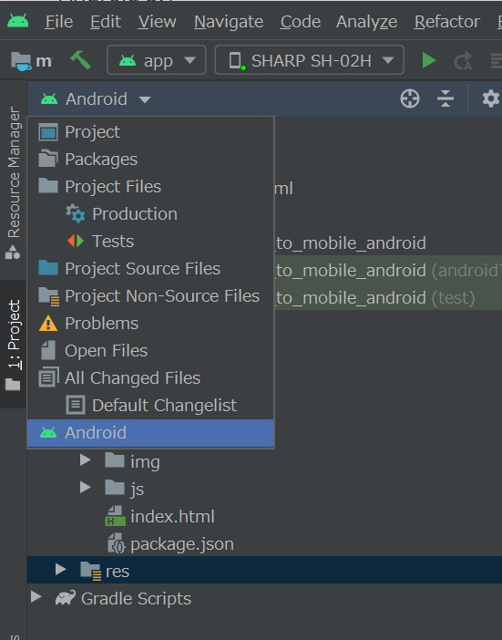

2. `app` > `java` > `com.example.mv_to_mobile_andorid` を右クリック > `Refactor` > `Rename` をクリックします。
    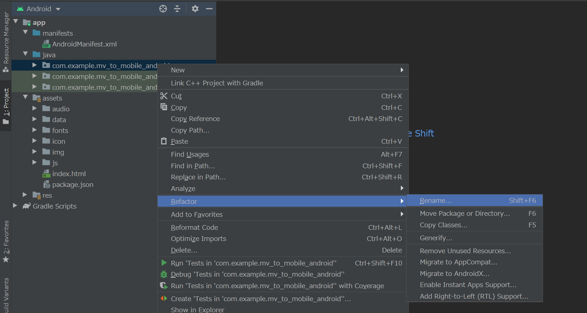

3. Warningが表示されますが、`Rename package`をクリックします。


4. 任意のパッケージ名を入力し、`Refactor`をクリックします。※com.example.mv_to_mobile_andoridの`mv_to_mobile_andorid`の部分のみ変更されます。
    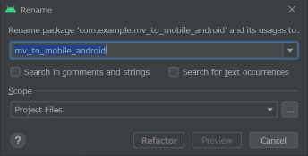


5. `Gradle Scripts` > `build.gradle(Module: app)`を開き、`applicationId`を任意のパッケージ名に変更します。その後、`Sync Now`をクリックします。
    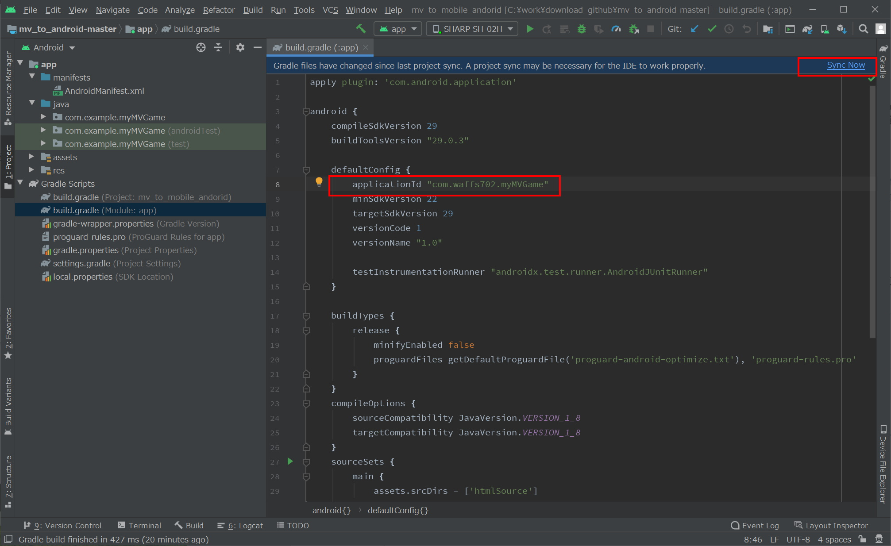


6. `app` > `manifests` > `AndroidManifest.xml` を開き、`package="com.example.XXXX"` (XXXXは入力したパッケージ名)の`example`の部分を右クリック > `Refactor` > `Rename` をクリックします。


7. Warningが表示されますが、`Rename package` をクリックします。


8. `build.gradle` で入力したものと同じものを入力して、 `Refactor` をクリックします。`example`の部分が入力したものに変更されます。
    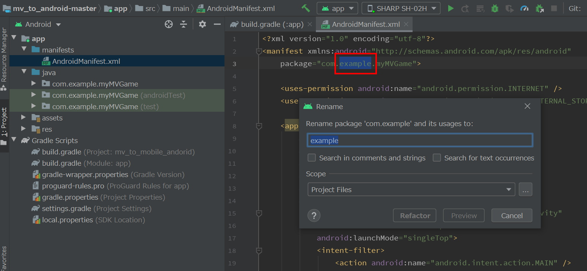


9. パッケージ名が変更されました。
    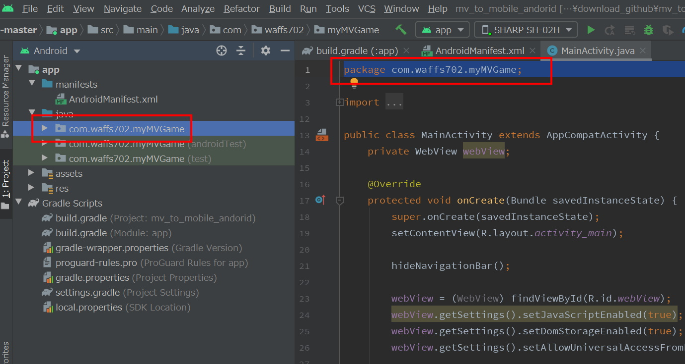


## 画面の向き変更方法

- `app\src\main\AndroidManifest.xml`を開き、`android:screenOrientation=`の部分を変更します。

  - 縦向き固定: `android:screenOrientation="portrait"`
  - 横向き固定: `android:screenOrientation="landscape"`

  ```xml
  <application
  ...
          <activity android:name="com.example.mv_to_mobile_android.MainActivity"
              android:screenOrientation="portrait"
              android:launchMode="singleTop">
              ...
          </activity>
  </application>
  ```


## 今後追加予定の機能

- バナー広告、動画広告
- push通知(Firebase)
- アプリ内課金
- Twitter画面スクリーンショットシェア


## License
MIT